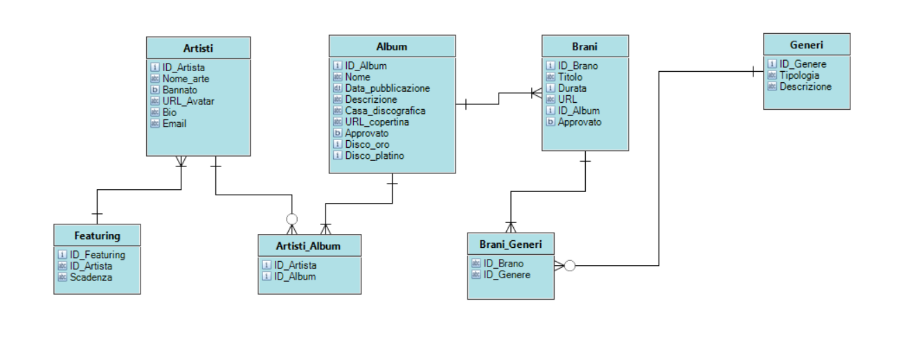

# D&BM

# Progettazione funzionale

Questa applicazione è stata creata con lo scopo di semplificare e far immedesimare l’utente nel modo migliore possibile nel mondo musicale ed inoltre semplificare e rendere più immediata la gestione generale di questa casa discografica.

Visione Utente: utente potrà consultare artisti, brani e album nella sua Home Page con la possibilità di ascoltarlo con la maggior semplicità possibile.

Visione Artista: artista invece potrà visualizzare nella sua home i suoi album e canzoni, con inoltre la possibilità di inserirli e di pianificarne la pubblicazione.

Visione Amministratore: amministratore infine dovrà approvare o no le pubblicazioni degli artisti, potrà bannare gli artisti iscritti al sito, scegliere i “Consigliati della casa” e gestire in generale il l’organizzazione del sito.

## WorkInProgress:

-	Amministratore potrà visualizzare le statistiche del sito e degli artisti.
-	Artista potrà visualizzare le sue statistiche.
-	Utenti potranno mettere mi/non piace alle canzoni.
-	Collaborazione con altro gruppo per l’ascolto di musica.
-	Utilizzare le API di altre piattaforme per l’inserimento in loro.
-	Possibilità di cercare l’artista in base al genere.
-	Possibilità di visualizzare per un Utente un tranding per gli Artisti.

# Progettazione tecnica

